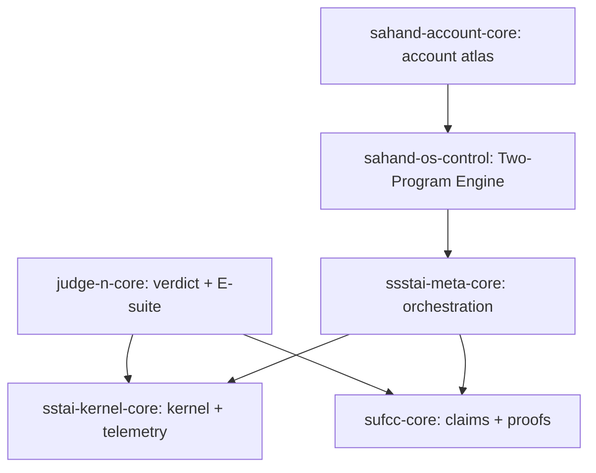

# ENGINE_PROFILE v0.2 — SSTAI × SSSTAI × SUFCC × Judge(ن)

This is the single-page **engine profile**: what each system is, how they connect, and where artifacts live.

---

## 1) Entities (strict roles)

### 1.1 SSTAI (kernel)
**Role:** runtime kernel + telemetry emitter + local invariants.  
**Repo:** `sstai-kernel-core`  
**Outputs:** kernel event logs, minimal schemas, policy docs.

### 1.2 SSSTAI (meta/orchestrator)
**Role:** decides WHAT runs exist (tasks, modes, releases), coordinates repos.  
**Repo:** `ssstai-meta-core`

### 1.3 SUFCC (research/proof engine)
**Role:** claims → obligations → tests → evidence packs.  
**Repo:** `sufcc-core`

### 1.4 Judge (ن)
**Role:** global verdict operator; the only allowed glue across systems.  
**Repo:** `judge-n-core`  
**Non-negotiable:** every meaningful action references `j_verdict_id`.

---

## 2) Dependency DAG (operational)

Interpretation:
- **J is the spine**. If J is missing, your system degenerates into unverifiable narrative.
- SUFCC can propose; only Judge can accept/reject.
- Kernel can run; only Judge can allow publishing.

---

## 3) Storage policy (your constraint)

### 3.1 “Brain mirror” (system / D:)
- Physical drive: `SSTAI_HOME (D:)`
- Mirror to **Google Drive** (live, large, "brain stays alive")

### 3.2 “Human archive” (docs / old)
- Use **Dropbox** (small 2GB; deliberately forces curation)
- Store only: PDFs, finalized evidence bundles, human-facing exports
- Never store the live brain mirror there

---

## 4) Live Backcheck protocol (fail-closed)

### Airtable (live)
Source of truth for run status:
- Base: `SSTAI_KERNEL_TELEMETRY`
- Table: `Runs`

Rule: every run record must contain enough evidence to replay:
- what was run
- what repo version (commit SHA)
- what Judge verdict id
- what outputs (attachments or hashes)

### GitHub (without direct connector)
You MUST generate local evidence using:
- `SSTAI_GH_BACKCHECK_KIT_v0_1.zip`
Outputs:
- `GH_BACKCHECK_*.json`
- `GH_BACKCHECK_*.txt`

Those outputs are the object I can verify.

---

## 5) Acceptance gate (minimum)
A release is **blocked** unless:
- E1–E4 are logged for the run
- `j_verdict_id` exists and is PASS
- placeholder scan finds 0 critical hits
- hashes exist for expected files
